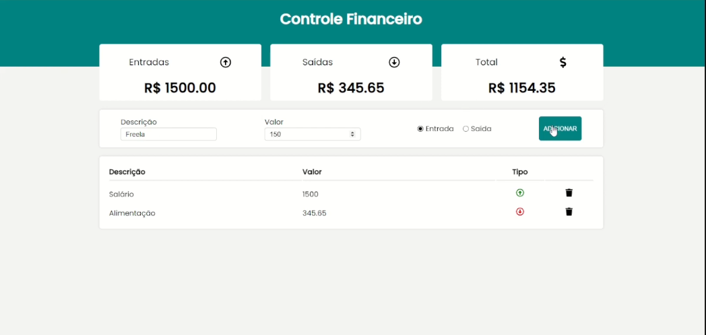

## 📌 Controle Financeiro

O Controle Financeiro é uma aplicação desenvolvida em React que permite ao usuário registrar e acompanhar suas movimentações financeiras de maneira simples e intuitiva. O sistema possibilita adicionar uma descrição, valor e selecionar o tipo da transação, indicando se é uma entrada ou saída. Após o registro, a aplicação exibe automaticamente o total de entradas, total de saídas e o saldo geral, facilitando o controle do orçamento.

---

## 🚀 Tecnologias usadas: 
- React / JavaScript
- html
- css

---
## ⚙ Como rodar o projeto
1 - Clone o repositório
    - git clone (url)

2 - Instale as dependeências
    - yarn install

3 - Execute o projeto
    - yarn start

4 - Se Der erro na instalacao
    - npm install -g yarn

---

## 📝 Funcionalidades

[x] Adição de Transações: Permite registrar novas movimentações financeiras informando descrição, valor e tipo (entrada ou saída).

[x] Classificação Visual: Cada transação exibida possui um ícone correspondente — seta verde para cima nas entradas e seta vermelha para baixo nas saídas — facilitando a identificação rápida.

[x] Cálculo Automático: O sistema soma automaticamente o total de entradas, o total de saídas e o saldo final, atualizando os valores conforme novas transações são adicionadas.

[x] Listagem das Movimentações: Todas as transações inseridas são exibidas em uma lista organizada contendo descrição, valor e tipo da operação.

